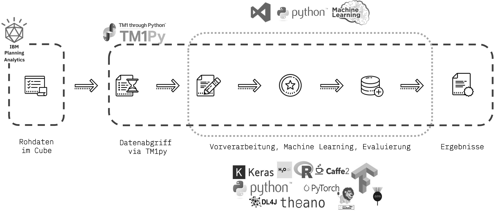

<!-- PROJECT LOGO -->
 

  

  <h3 align="center">Machine Learning in IBM Planning Analytics</h3>

  
 
    with Python, Jupyter Notebooks & H2O.ai
     
     
    <a href="https://gmc2.de/business-intelligence/live-hackathon-auf-der-tdwi/"><strong>BLOG</strong> | Hackathon at the TDWI</a>
     
    <a href="SelfMade_BigData_Analytics_Draft.pdf"><strong>WHITEPAPER</strong> | Self-made Big Data Analytics</a>
     
    <a href="https://www.tdwi.eu/fileadmin/tdwi/4.0_Verein/Young_Guns/BIS_01_17_Datenbasierte_Entscheidungshilfe_im_Bereich_Social_Media.pdf"><strong>PUBLICATION</strong> | Transparent analysis of business-relevant data</a>
     
  

<!-- TABLE OF CONTENTS -->

## Table of Contents

- [About the Project](#about-the-project)
  - [Built With](#built-with)
- [Usage](#usage)

<!-- ABOUT THE PROJECT -->

## About The Project

To get a first introduction to Machine Learning, we set ourselves the goal of creating a forecast of the number and price development of sold goods. First, we used TM1Py to load raw data from IBM Planning Analytics into a Jupyter notebook using a Python script. H2O allows us to determine the best machine learning algorithm and apply it to the raw data. The prediction or the results of this are then written back into the IBM Planning Analytics model. The result should enable meaningful and valid forecasts about the number and price development of sold goods. Furthermore, all the strengths of the primary analysis tool, such as the aggregation of goods according to different dimensions, can be used. The conception and implementation could be realised within only one week. Previous knowledge of all technologies is advisable in order to be able to use the advantages of both worlds and to fully exploit the strengths of IBM Planning Analytics and Machine Learning. 

### Built With

Major frameworks

- [IBM Planning Analytics](https://gmc2.de/planning-analytics/)
- [TM1py](https://github.com/cubewise-code/tm1py)
- [Python](https://www.python.org/)
- [Jupyter Notebooks](https://jupyter.org/)
- [H20 AutoML](https://docs.h2o.ai/h2o/latest-stable/h2o-docs/automl.html)

<!-- USAGE EXAMPLES -->

## Usage

Step by step guide for our prediction

_h2oprediction [ipynb](h2o_prediction.ipynb)_